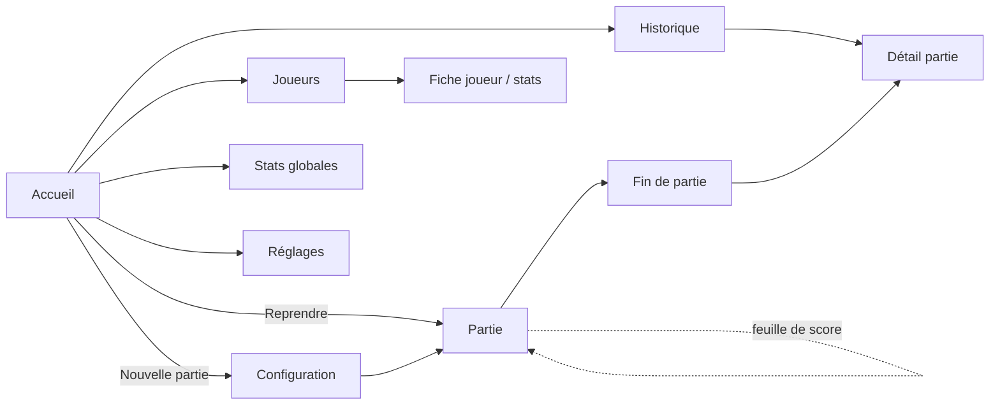
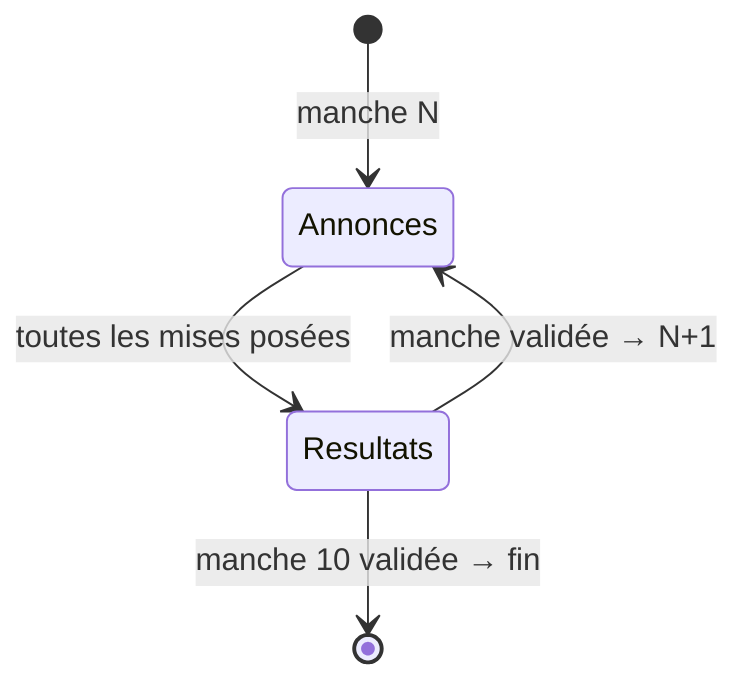

# Plan de développement — Application de score Skull King

> **Version 1.2 — 18 août 2026.** Document de cadrage **validé** (décisions actées en §13) ; la v1 couvre le comptage complet de la boîte 2021 (pouvoirs des pirates et variantes inclus) ; seul le libellé définitif du nom reste à figer, au plus tard en P6.
> Fondé sur trois recherches menées ce jour : les livrets officiels du jeu (EN 2024 + FR 2022), l'analyse d'une quinzaine d'apps concurrentes, et l'état de l'écosystème mobile cross-platform en août 2026. Sources en annexe B.

---

## 0. Résumé exécutif

Une app mobile iOS + Android de comptage de points pour Skull King, 100 % locale, gratuite et sans pub, construite avec **Expo / React Native + TypeScript**, stockage **SQLite (expo-sqlite + Drizzle ORM)**.

Positionnement issu de l'analyse concurrentielle : la référence iOS (« Skull King Scorekeeper », 4,84★) a une excellente saisie mais **ni historique, ni statistiques, ni Android, ni français**. Aucun leader cross-platform n'existe ; les apps Android ont des bugs de règles ou de la pub. Nos différenciateurs :

1. **Historique complet + statistiques par joueur** (le manque n°1 documenté dans les avis) ;
2. **Saisie sémantique des bonus** (« Sirène capture le Skull King ») avec valeurs exactes par édition, plutôt qu'un compteur ±10 brut ;
3. **Exactitude des règles** vérifiée sur les livrets officiels (validation tolérante au Kraken, mise 0 = ±10 × cartes distribuées, mode 2 joueurs avec fantôme…) ;
4. **iOS et Android au même niveau**, français + anglais, mode sombre.

Découpage en 8 phases (P0 → P7), moteur de score isolé et testé à 100 % dès la phase 1, bêta TestFlight + Play closed testing en fin de parcours. Ordre de grandeur : **23 à 37 jours-homme effectifs** en solo. La v1 couvre le **comptage complet de la boîte 2021** : scoring classique et Rascal, cartes avancées, pouvoirs des pirates, édition legacy.

---

## 1. Vision et positionnement

**Le job de l'app** : autour d'une table, entre deux manches, saisir annonces / plis / bonus de 2 à 8 joueurs en moins de 30 secondes, sans jamais se demander « comment ça se compte déjà ? » — puis, après la partie, raconter l'histoire : qui gagne vraiment sur la durée, qui annonce juste, qui tente les zéros.

**Ce que la concurrence a validé** (à reprendre) :

- Écran unique : annonces + plis + feuille de score cumulée toujours visible (la force de la référence iOS) ;
- Steppers +/− sans clavier, gros et rapides ;
- Vérification du total de plis **avec exception Kraken** (un pli peut être détruit) ;
- Reprise automatique d'une partie interrompue ;
- Édition libre de toute manche passée ;
- Gratuit, sans pub, sans compte — argument n°1 de tous les avis positifs.

**Ce que personne ne fait bien** (nos différenciateurs) : historique + stats, cross-platform de qualité égale, localisation FR, sélecteur d'édition de règles propre, saisie sémantique des bonus qui prévient les erreurs et « éduque » les nouveaux joueurs.

**Hors périmètre v1** (assumé) : mode multi-appareils temps réel (créneau ouvert mais gros chantier), extension 2026 (Mary Thorne, cartes 15, First Mate — prévu v1.2), annonces vocales, widget. Voir backlog §11.

---

## 2. Ce que la recherche a établi

### 2.1 Règles officielles — points structurants pour l'app

Vérifiés sur les livrets officiels (EN ©2024, FR ©2022 Blackrock Games) — spécification complète en §4 :

- La mise 0 vaut **±10 × cartes distribuées** (pas « × numéro de manche » : différent aux manches 9-10 à 8 joueurs, où l'on ne distribue que 8 cartes). Une app concurrente s'est fait démolir dans les avis pour un bug exactement là.
- Les **bonus ne comptent que si l'annonce est exacte** — invariant du moteur, pas de la saisie.
- Les valeurs de bonus **ont changé entre éditions** (Sirène capture Skull King : +50 avant, **+40 depuis 2021** ; « Pirate capture Sirène +20 » n'existe que depuis 2021) → le barème doit être **paramétré par édition**.
- **Kraken / Baleine blanche** peuvent détruire un pli → la somme des plis d'une manche peut être **inférieure** au nombre de cartes distribuées. Une validation stricte « Σ plis = N » est un bug.
- **2 joueurs** : mode officiel avec un fantôme (« Barbe Grise ») qui prend des plis mais ne mise ni ne marque → à 2 joueurs, Σ plis des joueurs ≤ N.
- Égalité en fin de partie → le livret prévoit une **manche supplémentaire**.

### 2.2 Concurrence — synthèse

| App                                                            | Plateformes | Historique | Stats   | FR  | Verdict                                                                                                                 |
| -------------------------------------------------------------- | ----------- | ---------- | ------- | --- | ----------------------------------------------------------------------------------------------------------------------- |
| **Skull King Scorekeeper** (Research and Market Insights B.V.) | iOS         | ❌         | ❌      | ❌  | La référence UX (4,84★, 467 avis) ; saisie 1 écran, checks de totaux, variantes Rascal. Le modèle à égaler côté saisie. |
| Score Skull King (TKO Apps)                                    | iOS+Android | ✅         | ❌      | ❌  | 4,73★ Android mais pas de saisie directe des plis (anti-pattern documenté).                                             |
| Skull King Score Calculator (sewookori)                        | iOS+Android | ✅         | ✅      | ✅  | Gère bien Kraken, mais **pubs** (reproche récurrent).                                                                   |
| Skull King Scoring (LP Dev)                                    | iOS+Android | ✅         | ✅      | ✅  | Très récente, 9 langues, extension 2026 — le concurrent le plus proche de notre cible, encore confidentiel.             |
| Autres (kynect, notariorob, Skull Keeper, Powerbee…)           | variées     | partiel    | partiel | ❌  | Notes 3-4★ : options manquantes, premium agressif, apps abandonnées, bugs de règles.                                    |

Enseignement de marque : **« Skull King » est une marque de Grandpa Beck's Games** (pas d'app mobile officielle, mais une web app bêta nommée… « Skull King Scorekeeper »). Une app tierce « Skull King Scorecard » a disparu des deux stores. → Nom distinctif + disclaimer + zéro artwork officiel (§12.1).

### 2.3 Écosystème technique (août 2026)

- **Expo SDK 57** (RN 0.86, React 19.2) : New Architecture désormais seule architecture, Hermes V1, cadence d'upgrade sans breaking changes. Builds locaux gratuits illimités, free tier EAS 15+15 builds/mois.
- **Flutter 3.47** : sain mais équipe Google réduite (~50 ing.) ; impose Dart.
- **expo-sqlite + Drizzle ORM** : intégration documentée officiellement des deux côtés (migrations versionnées, `useLiveQuery`).
- Maestro (E2E) gratuit en local ; jest-expo (SDK 57) + Jest 29 + RNTL stables — jest-expo n'est pas encore compatible Jest 30.
- Stores : Apple 99 $/an + build Xcode 26 obligatoire ; Google 25 $ une fois + **règle des 12 testeurs × 14 jours** pour les comptes personnels + target API 36 au 31/08/2026 (SDK 57 conforme). Privacy policy obligatoire même pour une app 100 % offline ; déclaration DSA « non-commerçant » pour l'UE.

---

## 3. Choix techniques

### 3.1 Framework : Expo / React Native — justification

**Choix : Expo SDK 57+ / React Native, TypeScript strict.**

| Critère                     | Expo/RN                                                   | Flutter                                                  |
| --------------------------- | --------------------------------------------------------- | -------------------------------------------------------- |
| Langage                     | **TypeScript (acquis)**                                   | Dart à apprendre (coût sec de plusieurs semaines)        |
| Perf pour une app de saisie | Largement suffisante (New Arch, Reanimated 4, 60-120 fps) | Excellente (sans objet ici)                              |
| UX ambitieuse               | Oui (Reanimated CSS + worklets, Skia, haptics)            | Oui                                                      |
| Écosystème 2026             | Meta + Expo + Shopify, cadence en hausse                  | Équipe réduite, maintenance sérieuse mais sans expansion |
| Distribution                | EAS Build/Submit ou builds locaux gratuits                | Outillage propre                                         |

Flutter serait un choix défendable pour un dev indifférent au langage ; ici, le gain de Dart est nul et le coût est réel. Kotlin Multiplatform (mûr mais hors monde TS), .NET MAUI et Capacitor (rendu web = plafond UX) sont écartés — détail dans le rapport de recherche.

**Conséquence d'architecture** : le moteur de score est écrit en **TypeScript pur, zéro import React Native** → testable en Jest sans émulateur, et réutilisable tel quel si un jour on veut une version web.

### 3.2 Stack détaillée

| Brique      | Choix                                                                            | Pourquoi                                                                                                      |
| ----------- | -------------------------------------------------------------------------------- | ------------------------------------------------------------------------------------------------------------- |
| Base        | Expo SDK 57+, TypeScript strict, dev builds locaux (`npx expo run:ios\|android`) | Standard 2026 ; Expo Go seulement pour dépanner                                                               |
| Navigation  | expo-router (Stack + onglets natifs)                                             | Routeur officiel, mûr, deep-linking gratuit                                                                   |
| Données     | **expo-sqlite + Drizzle ORM** (migrations drizzle-kit bundlées, `useLiveQuery`)  | Relationnel typé + SQL d'agrégats pour les stats ; migrations versionnées dès la v1                           |
| Préférences | expo-sqlite/kv-store                                                             | Clé-valeur simple, même dépendance                                                                            |
| State       | **Zustand v5** (saisie de manche en cours, UI)                                   | La DB reste la source de vérité ; state global minimal                                                        |
| Styling     | **NativeWind v4** (migration v5 quand promue stable)                             | Productivité solo + theming dark/light ; alternative Unistyles 3 si on préfère une API StyleSheet typée |
| Animations  | Reanimated 4 + expo-haptics                                                      | Micro-interactions de saisie (steppers, validation de manche)                                                 |
| Graphiques  | **victory-native (XL)** sur Skia                                                 | Courbes d'évolution et stats ; maintenu, GPU                                                                  |
| i18n        | i18next + expo-localization, FR + EN                                             | Le FR est quasi vierge chez les concurrents                                                                   |
| Divers      | expo-keep-awake (écran allumé en partie), expo-sharing (export JSON)             | Usage réel à table ; filet de sécurité données                                                                |
| Tests       | Jest 29 + jest-expo, RNTL, **Maestro** (E2E local gratuit)                       | §9                                                                                                            |
| CI          | GitHub Actions : typecheck + lint + tests sur PR                                 | Le repo est hébergé sur GitHub (décision du 18/08, §13.7)                                                     |
| Builds      | Locaux (gratuits) + free tier EAS ; EAS Submit pour publier                      | 15+15 builds/mois suffisent en solo                                                                           |

### 3.3 Qualité de code

ESLint + Prettier, TS `strict`, conventional commits (commitlint), versioning semver. Pas de CI mobile compliquée : la CI ne fait que typecheck/lint/tests JS ; les builds natifs restent manuels/EAS.

---

## 4. Spécification du scoring (le moteur de règles)

> Source de vérité : livrets officiels EN ©2024 et FR ©2022. C'est la spec du package `core/` — chaque ligne ci-dessous devient des tests.

### 4.1 Structure de partie

- **10 manches** par défaut ; manche N = **N cartes** par joueur. **2 à 8 joueurs.**
- **Cartes distribuées** : `cardsDealt = roundNumber`, **sauf à 8 joueurs : manches 9 et 10 → 8 cartes** (règle officielle). Valeur **modifiable manuellement** par manche (couvre les cas de table réels et variantes maison).
- **2 joueurs** : 3e main jouée par le fantôme **« Barbe Grise »** — ne mise pas, ne marque pas, mais **peut remporter des plis**. Les cartes Butin ne sont pas utilisées à 2 joueurs.
- Égalité au score final → **manche supplémentaire** proposée (règle officielle), ou co-vainqueurs si la table préfère.
- Le livret ne départage **que l'égalité en tête** : aux autres rangs, deux joueurs à égalité le restent (aucun critère officiel, ni plis ni bonus). Ils partagent leur rang au classement et **la même marche du podium**.

### 4.2 Barème — édition courante (2021+), le défaut de l'app

**Score de base** (par joueur, par manche) :

| Cas             | Points                                              |
| --------------- | --------------------------------------------------- |
| Mise ≥ 1 exacte | **+20 × mise**                                      |
| Mise ≥ 1 ratée  | **−10 × \|plis − mise\|** (rien pour les plis pris) |
| Mise 0 réussie  | **+10 × cartes distribuées**                        |
| Mise 0 ratée    | **−10 × cartes distribuées**                        |

**Bonus — uniquement si la mise est exacte** (sinon 0, quelles que soient les captures) :

| Bonus                                      | Points           | Contrainte de cohérence (par manche, tous joueurs confondus)                                                                                       |
| ------------------------------------------ | ---------------- | -------------------------------------------------------------------------------------------------------------------------------------------------- |
| 14 jaune / vert / violet dans un pli gagné | **+10 chacun**   | max 1 de chaque couleur                                                                                                                            |
| 14 noir (atout)                            | **+20**          | max 1                                                                                                                                              |
| Sirène capture le Skull King               | **+40**          | max 1 ; si Sirène + Pirate + SK dans le même pli : la Sirène gagne et c'est le **seul** bonus du pli                                               |
| Skull King capture des pirates             | **+30 / pirate** | max 6 (5 pirates + Tigresse jouée en pirate) ; ordre de jeu indifférent                                                                            |
| Pirate capture des sirènes                 | **+20 / sirène** | max 2                                                                                                                                              |
| Butin (alliance poseur + gagnant du pli)   | **+20 chacun**   | max 2 alliances ; les **deux** mises doivent être exactes ; pas d'alliance si le poseur gagne son propre pli ; accessible à un joueur ayant misé 0 |

**Cartes qui détruisent un pli** (impact comptage) :

- **Kraken** : pli détruit, personne ne le gagne.
- **Baleine blanche** : le plus haut numéro gagne (couleurs ignorées) ; pli 100 % cartes spéciales → pli défaussé.
- → Par manche, `plis détruits ∈ {0, 1, 2}` et **Σ plis attribués + plis détruits = cartes distribuées** (à 2 joueurs : + plis du fantôme).

**Tigresse** : déclarée pirate ou fuite au moment de jouer ; en pirate, elle compte pour les bonus (capturable par le SK à +30).

**Pouvoirs des pirates** (option officielle du livret 2021, activable à la création de partie — **dans la v1**) :

- **Harry le Géant** : le joueur qui gagne un pli avec Harry peut **modifier sa mise de ±1, ou la garder**. Modélisation : `bid_modifier ∈ {−1, 0, +1}` sur l'entrée du joueur, **un seul joueur par manche** (une seule carte Harry), mise effective = `bid + bid_modifier`, bornée à `[0, cartes distribuées]`. Le moteur score tout sur la **mise effective** — y compris la bascule mise 0 ↔ mise ≥ 1 et la condition d'exactitude des bonus ; la mise d'origine est conservée (affichage « 2 → 3 », stats honnêtes).
- **Pari de Rascal le Flambeur** : en jouant Rascal, le joueur peut parier **10 ou 20 points** sur sa propre annonce — **gagnés si la mise (effective) est exacte, perdus sinon**. Ce n'est pas un bonus : il est débité en cas d'échec, et il exige l'exactitude même en scoring Rascal (où l'écart de 1 donne pourtant 50 % du potentiel). `rascal_bet ∈ {0, 10, 20}`, un seul joueur par manche.

### 4.3 Éditions et variantes paramétrées

Le moteur reçoit un objet `Ruleset` ; le barème n'est jamais codé en dur dans l'UI.

```ts
interface Ruleset {
  edition: "current" | "legacy"; // legacy : Sirène→SK +50, pas de « Pirate capture Sirène »,
  // SK ne prime que les pirates joués AVANT lui, Butin old-rule
  advancedCards: boolean; // Kraken + Baleine + Butin en jeu (défaut : true)
  scoring: "classic" | "rascal"; // Rascal : potentiel 10×cartes ; exact = 100 %, ±1 = 50 %, sinon 0 ; jamais négatif
  rascalCannonball: boolean; // option Boulet de canon : 15×cartes si exact, 0 sinon (choix par joueur/manche)
  pirateAbilities: boolean; // v1 — pari de Rascal le Flambeur (±10/±20), Harry le Géant (mise ±1)
  roundsPlan: number[]; // défaut [1..10] ; formats officiels alternatifs en v1.1
}
```

**Périmètre v1** (décision actée le 18/08, §13) : **tout ce qui compte des points dans la boîte 2021 est dans la v1** — éditions `current` + `legacy`, cartes avancées, scoring `classic` **et** `rascal` (+ Boulet de canon), **pouvoirs des pirates** (Harry le Géant, pari de Rascal le Flambeur). Le moteur implémente tout dès la P1 ; l'UI des variantes et pouvoirs est exposée dans une phase dédiée (P5). Seuls les **formats de manches** officiels restent en v1.1 — ils ne changent pas le barème, et l'édition manuelle des cartes distribuées les couvre en attendant.

### 4.4 Invariants et validations (moteur, pas UI)

`validateRound()` renvoie des anomalies typées `error | warning` :

- `bid ∈ [0, cardsDealt]`, `tricks ∈ [0, cardsDealt]` — _error_ ;
- Σ plis + plis détruits ≠ cartes distribuées — _error_ (≤ à 2 joueurs, le solde allant au fantôme) ; l'UI peut « forcer » (cas table réelle : on ne sait plus qui a pris quoi) → la manche est marquée `forced` ;
- plis détruits > 0 sans `advancedCards` — _error_ ;
- contraintes de cohérence des bonus (tableau §4.2, unicité inter-joueurs) — _error_ ;
- bonus saisis sur une mise ratée — _toléré_ : le moteur les neutralise (l'UI les affiche barrés « sans effet » ; conservés pour la stat « bonus perdus ») ;
- Butin à 2 joueurs, alliance avec soi-même — _error_ ;
- `bid_modifier` ou `rascal_bet` non nuls alors que les pouvoirs des pirates sont désactivés — _error_ ; plus d'un Harry ou d'un pari de Rascal dans la même manche — _error_ ; mise effective hors `[0, cartes distribuées]` — _error_.

### 4.5 API du moteur (esquisse)

```ts
// core/ — TypeScript pur, zéro dépendance React Native
scoreRound(input: RoundInput, ruleset: Ruleset): PlayerRoundScore[]   // { base, bonus, total } par joueur
validateRound(input: RoundInput, ruleset: Ruleset): Issue[]
computeGame(rounds: RoundInput[], ruleset: Ruleset): GameState        // cumuls, classement, égalités
cardsDealtFor(roundNumber: number, playerCount: number): number       // règle 8 joueurs
```

Toute édition d'une manche passée = re-exécution de `computeGame` (10 manches × 8 joueurs : trivial).

---

## 5. Modèle de données (SQLite / Drizzle)

```
players        id PK · name · emoji · color · created_at · archived_at?
games          id PK · created_at · finished_at? · status (in_progress|finished|abandoned)
               · ruleset JSON · current_round · current_phase (bidding|results) · forced_rounds?
game_players   game_id FK · player_id FK · seat_index        PK(game_id, player_id)
rounds         id PK · game_id FK · round_number · cards_dealt · destroyed_tricks (0-2)
               UNIQUE(game_id, round_number)
round_entries  id PK · round_id FK · player_id FK · bid? · bid_modifier (−1|0|+1) · tricks?
               · rascal_bet (0|10|20) · custom_bonus (±10 pas)
               · score_base · score_bonus · score_total      -- snapshots (cache, recalculables)
               UNIQUE(round_id, player_id)
bonus_events   id PK · round_id FK · player_id FK (bénéficiaire) · type · count
               · ally_player_id FK?                          -- pour le Butin (l'allié)
```

Décisions :

- **`bonus_events` en table dédiée** (plutôt qu'un JSON ou des colonnes) : extensible sans migration quand l'extension 2026 arrivera, et agrégeable en SQL pour les stats (`GROUP BY type`).
- **Snapshots de score sur `round_entries`** : rendu instantané de la feuille de score et de l'historique ; le moteur reste la seule source de vérité, les snapshots sont recalculés à chaque édition.
- **Saisie = données brutes** (mises, plis, événements), jamais des points : on peut corriger un barème par mise à jour d'app et recalculer tout l'historique.
- `bid`/`tricks` nullables : la partie est sauvegardée **à chaque interaction** (annonces posées mais manche non jouée = état légitime après un kill de l'app).
- Joueurs **archivables**, jamais supprimés s'ils ont des parties (intégrité de l'historique) ; fusion de doublons en backlog.
- Préférences (langue, thème, ruleset par défaut, keep-awake) dans le kv-store, hors schéma relationnel.
- **Export / import JSON** de toute la base (partage, sauvegarde, migration de téléphone) — filet de sécurité d'une app 100 % locale.

---

## 6. Architecture applicative

```
app/                    # routes expo-router (fines : elles délèguent aux features)
src/
  core/                 # ⭐ moteur de règles — TS pur, zéro import RN, couvert à 100 %
    rules/              #    barèmes par édition + variantes (tables de constantes)
    scoring.ts · validation.ts · game.ts · types.ts
  db/
    schema.ts           # Drizzle
    migrations/         # générées par drizzle-kit, bundlées
    repositories/       # gameRepo · playerRepo · statsRepo (SQL d'agrégats)
  features/
    game/               # écrans + composants + store Zustand de la partie en cours
    history/  players/  stats/  settings/
  ui/                   # design system : tokens, Stepper, Chip, BottomSheet, ScoreSheet…
  i18n/                 # fr.json · en.json (noms de cartes officiels FR)
```

Principes : la **DB est la source de vérité** (lecture via `useLiveQuery` → l'UI se met à jour toute seule) ; Zustand ne porte que l'éphémère (saisie en cours avant commit de la manche, état d'UI) ; le `core/` ne connaît ni la DB ni React — les repositories font la traduction.

---

## 7. Écrans et parcours utilisateur

### 7.1 Carte des écrans



**Accueil** : carte « Reprendre la partie » (si une partie est en cours — reprise automatique après kill), bouton « Nouvelle partie », accès Historique / Joueurs / Stats / Réglages, aide-mémoire du barème.

**Configuration de partie** : sélection dans le roster (tri par fréquence de jeu) + création éclair d'un joueur (prénom → emoji/couleur auto), ordre autour de la table par glisser-déposer (détermine la rotation du donneur), options repliées par défaut : édition de règles, cartes avancées, pouvoirs des pirates, variante de score (classique/Rascal), nb de manches. Un joueur qui découvre l'app ne voit que : joueurs → « C'est parti ».

Les options **partent de la dernière partie créée** (ajouté le 20/08) : une table rejoue presque toujours de la même façon, et re-cocher les mêmes cases chaque soir est une corvée sans contrepartie. Les règles d'usine, elles, penchent vers « tout est là » — cartes avancées **et pouvoirs des pirates activés** : une table qui joue les pouvoirs sans les trouver dans l'app est bloquée en pleine manche, alors qu'une table qui ne les joue pas laisse simplement un bouton de côté. Le repli des options affiche un résumé des seuls **écarts** au défaut (« sans pouvoirs », « ancienne édition »…).

### 7.2 La partie — l'écran cœur

Un seul écran, deux phases par manche, la feuille de score toujours accessible :



- **En-tête** : « Manche 4 / 10 · 4 cartes », badge donneur, accès feuille de score (tiroir).
- **Phase Annonces** : une carte par joueur avec **gros stepper 0…N** (cible tactile ≥ 44 pt, utilisable d'une main, verre de rhum dans l'autre). **Tous les compteurs partent de 0** : autour de la table on ne touche que ce qui diffère, et annoncer 0 ne coûte aucun geste. Le 0 affiché n'est écrit en base qu'au moment où la manche est lancée — tant qu'il ne l'est pas, « pas encore saisi » et « a annoncé 0 » restent deux états distincts pour le moteur, ce qui empêche une manche ouverte de peser sur les totaux. Indicateur live : « Σ annonces 6 / 4 plis — table sur-annoncée » (info que les joueurs adorent). → « Lancer la manche ».
- **Phase Résultats** : mêmes cartes joueur : stepper **plis remportés** + pastille **bonus** (affiche le total courant, ex. « +40 ») ouvrant la bottom sheet (§7.3). Contrôle de manche : compteur « pli détruit (Kraken/Baleine) » 0-2 ; à 2 joueurs, ligne fantôme « Barbe Grise » en lecture seule qui absorbe le solde. Les plis restent « pas encore saisis » tant que personne ne touche leur compteur : la carte d'un joueur n'affiche ni liseré ni delta avant, et **rien n'est décompté sur la seule foi des annonces** — pendant que le pli se joue, la table lit toujours le score de la manche précédente.
- **Barre de validation** : « Σ plis 3 + 1 détruit = 4 ✓ » — le bouton « Valider la manche » ne s'active que si c'est cohérent ; échappatoire « forcer » (avec marquage de la manche) pour les cas de table insolubles.
- **Validation** → c'est **elle seule** qui fait avancer les totaux : animation courte des deltas de score + haptique, puis phase Annonces de la manche suivante. Saisie complète d'une manche à 4 joueurs : **objectif < 30 s**.
- **Feuille de score** (tiroir tirable) : façon carnet papier — colonnes joueurs, lignes 1-10 avec delta par manche, total courant, rang. **Taper une ligne = rouvrir cette manche** pour correction (recalcul en cascade automatique).
- Écran maintenu allumé (keep-awake), portrait et paysage, lisible à 8 joueurs.

### 7.3 Saisie des bonus — le point clé UX

Bottom sheet par joueur, en phase Résultats. **Saisie sémantique, pas de calcul mental** :

| Contrôle                                       | Type                                       | Règle d'UI                                                      |
| ---------------------------------------------- | ------------------------------------------ | --------------------------------------------------------------- |
| 14 jaune · 14 vert · 14 violet (+10)           | toggles                                    | uniques dans la manche : si déjà attribué, le chip montre à qui |
| 14 noir (+20)                                  | toggle                                     | unique                                                          |
| ⚔️ Sirène capture le Skull King (+40)          | toggle                                     | unique tous joueurs confondus                                   |
| ☠️ Skull King capture des pirates (+30/pirate) | stepper 0-6                                | plafonné par la cohérence inter-joueurs                         |
| 🧜 Pirate capture des sirènes (+20/sirène)     | stepper 0-2                                | total manche ≤ 2                                                |
| 💰 Butin (+20 chacun)                          | « ajouter une alliance » → choisir l'allié | ≤ 2 alliances/manche ; désactivé à 2 joueurs                    |
| 🏴 Harry le Géant : mise −1 / = / +1           | segmenté — si pouvoirs activés             | un seul joueur/manche ; mise effective bornée à [0, N] ; affiche « 2 → 3 » |
| 🎲 Pari de Rascal : aucun / 10 / 20            | chips — si pouvoirs activés                | un seul joueur/manche ; gagné si mise exacte, **débité** sinon  |
| Ajustement manuel (±10)                        | stepper                                    | filet de sécurité : règle maison, cas non couvert               |

- Les valeurs affichées viennent du `Ruleset` (édition courante : +40 ; legacy : +50 — jamais de valeur en dur).
- **Mise ratée** : bandeau « Mise ratée — bonus sans effet », valeurs barrées mais enregistrées (stat « bonus perdus », et si on corrige les plis ensuite, les bonus se réactivent).
- Deux gestes max pour le cas le plus fréquent (un 14 capturé) : pastille bonus → toggle → fermer.

### 7.4 Fin de partie, historique, joueurs, stats

- **Fin de partie** : podium animé — trois **rangs**, ex æquo groupés sur leur marche (§4.1) —, courbe d'évolution des scores (victory-native), **awards** auto (§8), gestion d'égalité (« manche supplémentaire » officielle ou co-vainqueurs), partage de la feuille de score en image (backlog v1.1), « revanche » (relance avec les mêmes joueurs).
- **Historique** : liste antichronologique (date, joueurs, vainqueur, score), détail = feuille de score complète + bonus par manche ; correction possible même après coup ; suppression.
- **Joueurs** : roster persistant (création à la volée pendant une config de partie, ou gestion dédiée), fiche joueur = identité + stats (§8) ; archivage.
- **Réglages** : langue (FR/EN), thème (système/clair/sombre), keep-awake, règles par défaut (reprises de la dernière partie, §7.1 — pas d'écran dédié), export/import JSON, aide-mémoire du barème, à-propos + mention « non affilié à Grandpa Beck's Games ».

---

## 8. Statistiques proposées

**Par joueur** (fiche joueur) :

- Parties jouées / gagnées, taux de victoire, position moyenne ;
- Score moyen / meilleur / pire ; évolution sur les dernières parties (courbe) ;
- **Précision d'annonce** : % de manches exactes, écart moyen |mise − plis| ;
- **Précision par numéro de manche** (courbe 1→10) — révèle les profils « fort en petites manches, fébrile en fin de partie » ;
- Mises 0 : tentées, réussies, taux, points rapportés ;
- Bonus : points bonus cumulés + détail par type (Skull King capturés à la sirène, pirates capturés, 14 noirs…), bonus « perdus » sur mise ratée ;
- Pouvoirs : paris de Rascal gagnés/perdus, « sauvetages Harry » (mises ajustées puis réussies) ;
- Face-à-face contre chaque joueur du roster ; séries (victoires consécutives, manches exactes d'affilée).

**Globales** : classement all-time, records (meilleur score en une partie, meilleure manche), nombre de parties/manches jouées.

**Awards de fin de partie** (fun, auto) : 🎯 Visionnaire (plus d'annonces exactes) · 🔥 Tête brûlée (plus gros écart cumulé) · 💰 Chasseur de primes (plus de points bonus) · ⚓ Amiral du zéro (mises 0 réussies).

Implémentation : SQL d'agrégats dans `statsRepo` (jointures `round_entries` × `bonus_events`), testé sur fixtures.

---

## 9. Stratégie de tests

| Niveau               | Outil                         | Cible                                                                                                                                                                                                                                                                                       |
| -------------------- | ----------------------------- | ------------------------------------------------------------------------------------------------------------------------------------------------------------------------------------------------------------------------------------------------------------------------------------------- |
| **Moteur de score**  | Jest (TS pur, sans émulateur) | **100 % des branches de `core/`** — tests table-driven reprenant chaque ligne du §4, les exemples chiffrés des livrets officiels comme golden tests, les cas vicieux : Kraken, mise 0 manche 9 à 8 joueurs, Sirène+Pirate+SK même pli, Butin avec mise 0, édition legacy, fantôme 2 joueurs, Harry ±1 (bascule mise 0 ↔ ≥ 1), pari de Rascal perdu |
| Composants critiques | RNTL + jest-expo              | Steppers, bottom sheet bonus (unicité inter-joueurs), barre de validation, i18n                                                                                                                                                                                                             |
| Requêtes stats       | Jest + SQLite in-memory       | `statsRepo` sur fixtures de parties connues                                                                                                                                                                                                                                                 |
| E2E                  | **Maestro** (local, gratuit)  | 3 parcours : ① partie complète 10 manches → podium → historique ; ② kill de l'app en pleine manche → reprise exacte ; ③ édition d'une manche passée → cascade des totaux                                                                                                                    |
| Manuel               | Devices réels                 | iPhone récent + petit écran, Android milieu de gamme ; test « vraie soirée jeu » avant la bêta                                                                                                                                                                                              |

La CI GitHub Actions exécute typecheck + lint + Jest sur chaque PR. Maestro en local avant chaque release.

---

## 10. Distribution et conformité stores

- **Comptes — état au 18/08/2026** : côté **Apple**, un compte existe mais n'a jamais été enrôlé au programme payant (profil gratuit = installation locale sur son propre appareil, expirant sous 7 jours — **pas de TestFlight ni d'App Store**) → **enrôlement Apple Developer Program (99 $/an) en P6**, validation généralement sous 24-48 h. Côté **Google Play, aucun compte : création (25 $, unique) dès la P3** — la vérification d'identité peut prendre plusieurs jours, et un compte personnel neuf impose le test fermé avec **12 testeurs opt-in pendant 14 jours** avant l'accès production → lancer le closed testing dès la fin de P3 avec un build intermédiaire, pour purger le délai en parallèle du développement.
- **Builds** : locaux (gratuits, illimités) au quotidien ; EAS Build (free tier 15+15/mois) pour les builds de distribution ; EAS Submit vers TestFlight / Play Console. Build iOS avec **Xcode 26 / SDK iOS 26** (exigence Apple depuis avril 2026) ; cible **Android API 36** (Expo SDK 57 conforme) ; iOS minimum 16.
- **Bêta** : TestFlight (interne puis externe) + Play closed testing ; recruter la table de jeu habituelle comme testeurs (double usage : la règle des 12, et du feedback réel).
- **Conformité** : page statique de politique de confidentialité « aucune donnée collectée » (obligatoire sur les deux stores même en 100 % offline) ; formulaire Data Safety (Google) et « Data Not Collected » (Apple) ; déclaration DSA **non-commerçant** pour l'UE (app gratuite sans revenus).
- **Fiches stores** : FR + EN, captures d'écran par plateforme, nom conforme §12.1, description mentionnant la compatibilité avec le jeu sans usurper la marque, disclaimer « non affilié ».
- **Modèle** : gratuit, sans pub, sans compte, sans tracking. (Un « tip » optionnel façon référence iOS est possible plus tard — hors périmètre v1.)

---

## 11. Découpage en phases

> Estimations en **jours-homme effectifs**, solo, TypeScript confirmé. Total : **23-37 j-h**. Chaque phase se termine par un critère d'acceptation vérifiable.

| #      | Phase                | Contenu                                                                                                                                                                                                                                | Estim.                | Critère d'acceptation                                                                                                                           |
| ------ | -------------------- | -------------------------------------------------------------------------------------------------------------------------------------------------------------------------------------------------------------------------------------- | --------------------- | ----------------------------------------------------------------------------------------------------------------------------------------------- |
| **P0** | Fondations           | `git init` + repo GitHub + CI ; Expo SDK 57 TS strict ; expo-router squelette ; NativeWind + tokens (light/dark) ; ESLint/Prettier/commitlint ; jest-expo                                                                              | 1-2 j                 | L'app démarre sur iOS et Android ; CI verte sur PR                                                                                              |
| **P1** | ⭐ Moteur de score   | `core/` complet : barèmes current/legacy, classic + Rascal, **pouvoirs des pirates** (Harry ±1, pari de Rascal), validations, `computeGame`, `cardsDealtFor` ; tests exhaustifs §9                                                                                                          | 2-3 j                 | 100 % branches sur `core/` ; tous les cas du §4 encodés en tests ; zéro import RN                                                               |
| **P2** | Partie jouable (MVP) | Schéma DB + migrations ; config de partie (joueurs ad hoc) ; écran de partie complet (annonces → résultats → bonus sheet → validation) ; feuille de score ; fin de partie (podium) ; **reprise après kill** ; édition de manche passée | 5-8 j                 | Une vraie partie de 10 manches se joue de bout en bout sur device ; kill/relaunch reprend exactement ; Maestro ① vert                           |
| **P3** | Joueurs & historique | Roster persistant (CRUD, archivage, tri par fréquence) ; historique liste + détail ; export/import JSON                                                                                                                                | 3-5 j                 | Joueurs réutilisables entre parties ; détail d'une partie fidèle ; export→import sans perte. **→ Créer le compte Google Play (25 $) et déclencher le closed testing (14 j) ici** |
| **P4** | Statistiques         | `statsRepo` (SQL agrégats) ; fiche joueur ; stats globales ; graphiques victory-native ; awards de fin de partie                                                                                                                       | 3-5 j                 | Stats justes vérifiées par tests sur fixtures ; graphiques fluides                                                                              |
| **P5** | Variantes & pouvoirs (UI) | Config de partie : variante de score (classique / Rascal / Boulet de canon) + pouvoirs des pirates ; saisie Harry le Géant (mise ±1) et pari de Rascal (±10/±20) en phase Résultats ; affichage du potentiel Rascal | 2-3 j | Une partie en scoring Rascal avec pouvoirs se joue de bout en bout (moteur prêt depuis P1, l'UI ne fait qu'exposer) |
| **P6** | Polish & i18n        | Micro-interactions (Reanimated + haptics) ; dark mode finalisé ; paysage/tablette ; accessibilité (Dynamic Type, VoiceOver, contrastes) ; i18n FR/EN complet ; icône + splash originaux ; keep-awake ; aide-mémoire barème ; **nom définitif figé (§13.1)** ; enrôlement Apple Developer Program| 4-6 j                 | Revue UX sur 3 devices ; zéro chaîne hors i18n ; audit contraste AA                                                                             |
| **P7** | Bêta & release       | **Traductions ES + DE** (§13.3) ; Maestro ②③ ; builds distribution (Xcode 26, API 36) ; TestFlight + Play closed → production ; privacy policy ; fiches stores FR/EN/ES/DE ; screenshots                                              | 4-6 j + délais stores | App approuvée et publiée sur les deux stores, en quatre langues                                                                                 |

**Écart assumé sur le calendrier** : le **design system a été implémenté à la fin de P2** (19/08/2026) plutôt qu'en P6, la maquette étant arrivée pendant les tests de la partie jouable — jetons, composants et les sept écrans déjà livrés. P6 garde donc les micro-interactions, le paysage/tablette, l'accessibilité, l'i18n, l'icône et le splash ; les écrans de P3 à P5 s'écrivent directement au design system.

**Backlog post-v1** (ordre indicatif) : v1.1 = formats de manches officiels (Tourbillon, Attaque éclair…) + partage de la feuille de score en image + mode « scores cachés jusqu'à la fin ». v1.2 = **extension 2026** (Mary Thorne, cartes 15, First Mate — la concurrence vient d'y passer). Plus tard : fusion de joueurs doublons, multi-appareils temps réel (créneau identifié, personne n'a percé), widget « qui a gagné hier ».

---

## 12. Points de vigilance

1. **Marque « Skull King »** (Grandpa Beck's Games) : ne pas faire de « Skull King » la **marque** de l'app (précédent : une app retirée des stores ; collision avec la web app officielle « Skull King Scorekeeper »). → Stratégie actée en §13.1 : marque courte distincte + « Skull King » en **usage descriptif** dans les champs indexés par la recherche, disclaimer « non affilié », **aucun artwork officiel** (thème pirate générique original). Apple 4.1/5.2 et Google Brand/IP retirent une app sur simple plainte du titulaire ; le risque résiduel de l'usage descriptif est assumé — c'est la pratique de la douzaine d'apps tierces en place depuis 2020.
2. **Exactitude des règles = réputation** : les avis démolissent les apps fausses (cas documenté : « annonce 0 ratée = −10 fixe »). Parades : barème centralisé dans `core/rules/` avec les URL des livrets en commentaire, golden tests issus des exemples officiels, veille sur les nouvelles éditions (le dev de la référence doit son 4,84★ à sa réactivité).
3. **Kraken/Baleine** : toute validation « Σ plis = N » stricte est un bug ; le compteur « pli détruit » doit être visible sans être envahissant. À 2 joueurs, le fantôme absorbe le solde.
4. **Mise 0 = ±10 × cartes distribuées** (pas × numéro de manche) — visible uniquement à 8 joueurs manches 9-10, exactement le genre de bug silencieux.
5. **Édition d'une manche passée** : recalcul en cascade des snapshots — passer systématiquement par `computeGame`, jamais de delta manuel.
6. **Migrations DB dès la v1** (drizzle-kit) : la v1.2 (extension 2026) ajoutera des types de bonus ; `bonus_events` est extensible mais la discipline de migration doit exister avant. Export JSON = filet de sécurité utilisateur.
7. **Google Play compte perso** : 12 testeurs × 14 jours — à anticiper dès P3, sinon la release glisse d'un mois.
8. **Fenêtres de conformité** : builds iOS sous Xcode 26 obligatoires ; target API 36 au 31/08/2026 (OK avec SDK 57) ; rester proche du dernier SDK Expo (la régression Hermes du SDK 56, corrigée en 57, a montré le coût de traîner).
9. **NativeWind v5 en fin de RC** : démarrer en v4 stable, migrer quand la v5 est promue (changement faible).
10. **Usage à table** : cibles tactiles ≥ 44 pt, saisie à une main, keep-awake, lisibilité en luminosité faible (soirée) — à tester en conditions réelles, pas seulement en simulateur.
11. **App 100 % locale** : la perte du téléphone = perte des données ; l'export JSON et (plus tard) une sauvegarde iCloud/Drive répondent au risque — à mentionner honnêtement dans l'app.

---

## 13. Décisions actées (18/08/2026)

1. **Nom de l'app — contrainte posée : être trouvé en cherchant « skull king » sur l'App Store et Google Play** (les noms français thématiques sont écartés pour cette raison ; le jeu garde d'ailleurs son nom anglais dans l'édition française, les joueurs FR cherchent donc le même terme). Stratégie retenue : **marque courte distincte + « Skull King » dans les champs indexés par la recherche** — la trouvabilité sans faire de la marque déposée le nom de l'app :
   - **App Store** : la recherche indexe le nom, le **sous-titre** et le champ **mots-clés** (100 car., invisible) → nom court (ex. « Skull Scores »), sous-titre « Score & stats pour Skull King », mots-clés incluant *skull king* ;
   - **Google Play** : la recherche indexe le titre (30 car.) et les descriptions → titre type « Skull Scores – Skull King », description courte « Score, historique et stats pour vos parties de Skull King » ;
   - Candidats de marque : **« Skull Scores »** (reco — lisible FR/EN ; vérifier la proximité avec l'app existante « SkullScore » au moment de la soumission), « Skull Tally » (zéro collision connue), ou option frontale « Skull King Scores » (ASO maximal, risque marque plus exposé — toléré de fait pour une douzaine d'apps depuis 2020, mais non recommandé) ;
   - Dans tous les cas : disclaimer « non affilié à Grandpa Beck's Games », zéro artwork officiel. **Libellé définitif à figer en P6** (avant icône + fiches stores), après vérification de disponibilité. Le repo reste `skullking`.
2. **Périmètre de comptage** (mis à jour le 18/08 après échange) : **la v1 doit être complète en matière de comptage de points** — la table de l'utilisateur joue avec les pouvoirs des pirates. Donc en v1 : scoring classique **et** Rascal/Boulet de canon, **pouvoirs des pirates** (Harry le Géant mise ±1, pari de Rascal ±10/±20), cartes avancées, édition legacy. Moteur dès P1, UI dédiée en P5. Seuls les formats de manches restent en v1.1 (sans impact sur le barème, couverts entre-temps par l'édition manuelle des cartes distribuées).
3. **Langues v1** : FR + EN + **ES + DE** — décision du 20/08/2026, après P6. Le marché du jeu est très largement germanophone et hispanophone ; s'en priver pour quatre cents chaînes à traduire n'a pas de sens dès lors que l'infrastructure i18n existe (catalogue plat et typé, une traduction manquante casse la compilation). Livraison en P7, avant la soumission aux stores — les fiches stores suivent les mêmes langues.
4. **Comptes développeur** : Apple = compte existant jamais enrôlé au programme payant → enrôlement (99 $/an) en P6 ; Google Play = aucun compte → création (25 $) dès P3, puis règle des 12 testeurs × 14 jours (§10).
5. **Direction design** : sobre et moderne, touches pirates discrètes (emojis de bonus, awards) — pas d'habillage pirate appuyé. **Design system arrêté le 19/08/2026** (maquette Claude Design « Skull King Score », implémentée en fin de P2) : le **mode sombre est le mode réel d'usage** — une table, le soir — et sert de référence, le clair est produit au même niveau de finition ; accent **corail** `#E8785A` (clair `#B34A27`, assombri après l'audit de contraste de P6 : le `#D5643F` de la maquette ne passait pas le seuil AA sous du texte blanc), fonds `#0E1420` / `#1C2436`, or pour les bonus, vert et rouge pour le résultat d'une mise ; typographie **Outfit** en quatre graisses ; huit couleurs d'identité de joueur, en pastille et en liseré, jamais derrière du texte. Les jetons vivent dans `src/global.css` et `src/ui/tokens.ts`, tenus alignés par un test — l'UI ne code jamais une couleur en dur. Le décor reste des emojis génériques : aucun artwork officiel (§12.1).
6. **Monétisation** : gratuit, sans pub, sans compte, sans tracking.
7. **Hébergement du code** : **GitHub** (et non GitLab comme envisagé initialement) ; CI par GitHub Actions sur chaque pull request.

---

## Annexe A — Barème complet (aide-mémoire, édition 2021+)

| Événement                    | Points                   | Condition                                        |
| ---------------------------- | ------------------------ | ------------------------------------------------ |
| Mise ≥ 1 exacte              | +20 × mise               | —                                                |
| Mise ≥ 1 ratée               | −10 × écart              | rien pour les plis pris                          |
| Mise 0 réussie               | +10 × cartes distribuées | 0 pli                                            |
| Mise 0 ratée                 | −10 × cartes distribuées | ≥ 1 pli                                          |
| 14 jaune/vert/violet capturé | +10 chacun               | mise exacte                                      |
| 14 noir capturé              | +20                      | mise exacte                                      |
| Sirène capture le Skull King | +40 _(legacy : +50)_     | mise exacte ; seul bonus du pli Sirène+Pirate+SK |
| Skull King capture un pirate | +30 / pirate             | mise exacte ; Tigresse-pirate incluse            |
| Pirate capture une sirène    | +20 / sirène             | mise exacte ; n'existe pas en legacy             |
| Butin                        | +20 pour chaque allié    | les deux mises exactes                           |
| Pari de Rascal (pouvoir)     | +10/+20 si mise exacte, −10/−20 sinon | pouvoirs des pirates activés ; un seul par manche |
| Harry le Géant (pouvoir)     | mise ±1 (ou inchangée) avant décompte | pouvoirs des pirates activés ; un seul par manche |
| Kraken joué                  | pli détruit              | Σ plis attribués < cartes distribuées            |
| Baleine, pli 100 % spécial   | pli défaussé             | idem                                             |

## Annexe B — Sources principales

**Règles** : [Livret officiel EN ©2024 (PDF)](https://cdn.shopify.com/s/files/1/0565/3230/4053/files/Skull_King_Simplified_Rulebook_US_WEB_NO_CROP_a0eb3b84-f1cd-4087-8bda-0aab43d231af.pdf) · [Livret officiel FR ©2022 (PDF)](https://cdn.shopify.com/s/files/1/0565/3230/4053/files/SK_FR_Rulebook_Optimized.pdf) · [Fiche Rascal's Scoring (PDF)](https://cdn.shopify.com/s/files/1/0565/3230/4053/files/Skull_King_Rascal_Scoring.pdf) · [FAQ officielle](https://www.grandpabecksgames.com/pages/skull-king) · [Aide BGA](https://en.doc.boardgamearena.com/Gamehelpskullking)

**Concurrence** : [Skull King Scorekeeper (iOS)](https://apps.apple.com/us/app/skull-king-scorekeeper/id1589596877) · [Skull King Scoring (LP Dev)](https://apps.apple.com/us/app/skull-king-scoring/id6757185193) · [Score Skull King (TKO)](https://play.google.com/store/apps/details?id=com.tkoapps.calavera) · [Skull King Score Calculator (sewookori)](https://play.google.com/store/apps/details?id=com.sewookori.skullking_scoresheet) · Threads BGG : [Scoring Apps](https://boardgamegeek.com/thread/2860359/skull-king-scoring-apps), [app officielle ?](https://boardgamegeek.com/thread/2685942/grandpa-beck-s-scoring-app)

**Technique** : [Expo SDK 57](https://expo.dev/changelog/sdk-57) · [Pricing EAS](https://expo.dev/pricing) · [Builds locaux](https://docs.expo.dev/build-reference/local-builds/) · [expo-sqlite](https://docs.expo.dev/versions/latest/sdk/sqlite/) · [Drizzle × Expo](https://orm.drizzle.team/docs/connect-expo-sqlite) · [victory-native XL](https://github.com/FormidableLabs/victory-native-xl) · [Maestro](https://github.com/mobile-dev-inc/Maestro) · [Exigences Apple](https://developer.apple.com/news/upcoming-requirements/) · [Google Play : 12 testeurs](https://support.google.com/googleplay/android-developer/answer/14151465?hl=en) · [Target API](https://support.google.com/googleplay/android-developer/answer/11926878?hl=en) · [Flutter 3.47](https://flutter.dev/blog/whats-new-in-flutter-3-47)
