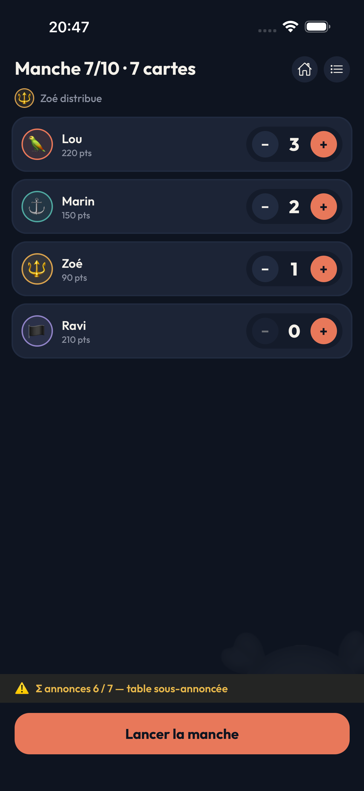
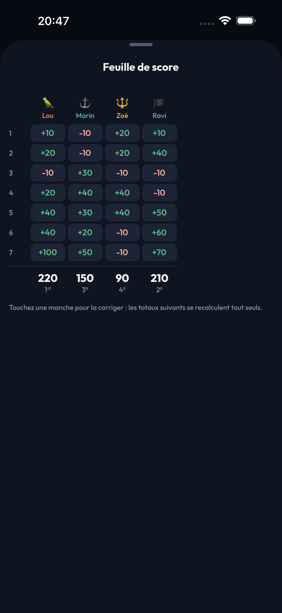
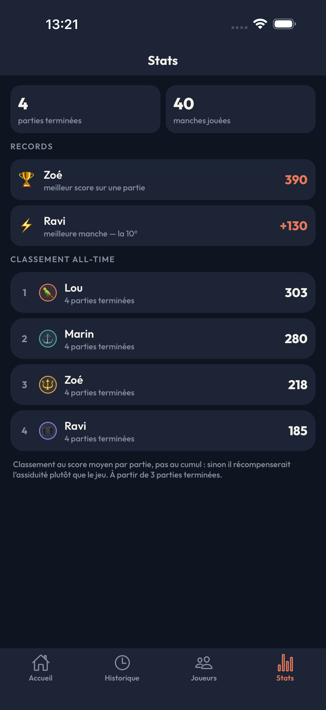

<h1 align="center">Skull Scores</h1>

<p align="center">
  Le compteur de points du jeu de cartes <strong>Skull King</strong>.<br>
  100 % hors ligne, gratuit, sans publicité ni compte.
</p>

<p align="center">
  
  
  
</p>

---

## À quoi ça sert

Skull King se joue en dix manches, chacune avec son barème, ses bonus et ses pièges. Compter les
points au papier, c'est se tromper — et découvrir l'erreur trois manches plus tard.

Skull Scores fait ce calcul à ta place. Tu saisis ce qui s'est passé à table : les annonces, les
plis remportés, les bonus. L'app applique le barème exact de ton édition de règles et tient
l'historique.

|                                Annoncer                                |                               Suivre                               |                           Comparer                           |
| :--------------------------------------------------------------------: | :----------------------------------------------------------------: | :----------------------------------------------------------: |
|  |  |  |

## Ce que tu y trouves

- **Le barème exact, par édition.** Règles actuelles ou historiques, cartes avancées, décompte
  classique ou Rascal, Boulet de canon, pouvoirs des pirates — tout se règle avant la partie.
- **Une saisie qui te rattrape.** L'app repère les incohérences pendant que tu tapes : total de
  plis impossible, table sur- ou sous-annoncée. Un avertissement, pas un blocage.
- **Rien n'est figé.** Une erreur trois manches plus tôt se corrige : toute la feuille se
  recalcule. Les points ne sont jamais stockés, seulement les faits.
- **Un historique et des statistiques.** Précision des annonces, meilleure manche, classement
  all-time, palmarès par joueur.
- **Hors ligne, pour de vrai.** Aucun compte, aucun serveur, aucune donnée qui sort du téléphone.
  Export et import en un fichier si tu changes d'appareil.
- **Quatre langues.** Français, anglais, espagnol, allemand.

> Application non affiliée à Grandpa Beck's Games, éditeur de Skull King.

## Démarrer

Il te faut **Node 24+**, et Xcode (iOS) ou Android Studio (Android) pour lancer sur un appareil.

```bash
npm install
npm start         # serveur Metro seul
npm run ios       # build de développement iOS
npm run android   # build de développement Android
```

Le projet tourne sur **Expo SDK 57**. La documentation d'Expo évolue vite : consulte la
[version correspondante](https://docs.expo.dev/versions/v57.0.0/), pas `latest`.

## Scripts

| Script              | Rôle                                     |
| ------------------- | ---------------------------------------- |
| `npm run typecheck` | TypeScript en mode strict, sans émission |
| `npm run lint`      | ESLint (config Expo)                     |
| `npm run format`    | Prettier en écriture                     |
| `npm test`          | Jest + Testing Library                   |
| `npm run test:ci`   | Jest avec couverture (utilisé par la CI) |

Les trois vérifications (typecheck, lint, tests) tournent en pre-commit via Husky, et sur chaque
pull request via [`.github/workflows/ci.yml`](.github/workflows/ci.yml).

## Comment c'est organisé

```
src/
  app/        routes expo-router — fines, elles délèguent aux features
  core/       ⭐ moteur de règles : TypeScript pur, zéro import React Native
  db/         schéma Drizzle, migrations, repositories
  features/   écrans et logique par domaine : game, history, players, stats
  ui/         design system : jetons, composants partagés
  i18n/       catalogues fr · en · es · de, typés
docs/
  privacy/    politique de confidentialité (publiée via GitHub Pages)
  store/      fiches App Store et Play Store, captures d'écran
```

Deux règles d'architecture gouvernent tout le reste :

1. **`src/core` ne connaît ni React, ni la base de données, ni l'UI.** Il se teste en Jest sans
   émulateur, et une règle ESLint dédiée empêche la moindre fuite.
2. **La saisie enregistre des données brutes** — mises, plis, événements de bonus — jamais des
   points. C'est ce qui rend possible de corriger un barème et de recalculer tout l'historique.

Le cadrage complet (règles du jeu, barème par édition, modèle de données, écrans, découpage en
phases) est dans [`PLAN.md`](./PLAN.md). Les renvois `PLAN.md §4.2` disséminés dans le code y
pointent.

## Le moteur de score

`src/core` est la pièce maîtresse : du TypeScript pur, couvert à 100 % branches comprises.

```ts
import { computeGame, scoreRound, validateRound, cardsDealtFor, DEFAULT_RULESET } from '@/core';

cardsDealtFor(9, 8); // 8 — à 8 joueurs, les manches 9 et 10 tombent à 8 cartes
validateRound(round, ruleset); // codes d'anomalie typés, `error` ou `warning`
scoreRound(round, ruleset); // { base, bonus, lostBonus, rascalBet, custom, total } par joueur
computeGame(rounds, ruleset); // cumuls, classement, égalité en tête
```

Le `Ruleset` porte tout ce qui change d'une table à l'autre : édition (`current` / `legacy`),
cartes avancées, décompte (`classic` / `rascal` + Boulet de canon) et pouvoirs des pirates.
Aucune valeur de barème ne doit être recopiée ailleurs — elles vivent toutes dans
[`src/core/rules/editions.ts`](src/core/rules/editions.ts).

## Le thème

Les couleurs vivent en double : variables CSS dans `src/global.css` (consommées par NativeWind) et
miroir JavaScript dans `src/ui/tokens.ts` (thème de navigation, graphiques). Un test garantit que
les deux ne divergent pas.

## Contribuer

Les contributions sont bienvenues. [`CONTRIBUTING.md`](./CONTRIBUTING.md) détaille la mise en
route, les invariants à respecter et le fonctionnement des pull requests.

En résumé : commits conventionnels (`feat:`, `fix:`, `chore:`…) vérifiés par commitlint, PR
ouvertes contre `develop`, `main` réservée aux releases taguées, CI verte obligatoire avant merge.

## Licence

[MIT](./LICENSE) © 2026 Ludovic Blondon
